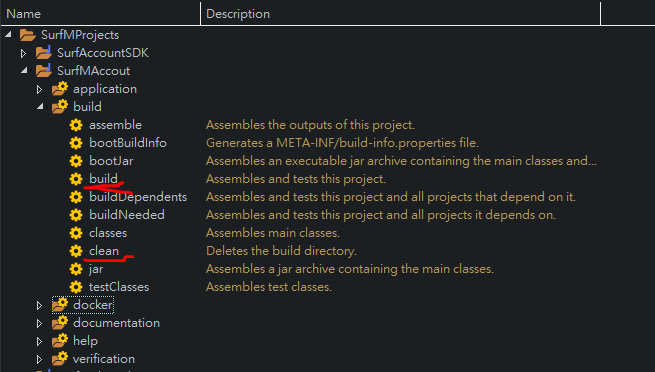
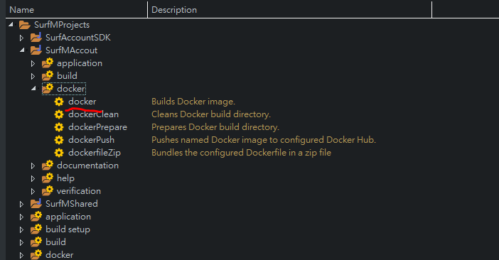

# gradle-multi-project-integration-springboot-and-docker-example

Basic gradle multi-project + springboot(2.14) + com.palantir.docker(gradle lib)

## included

- spring-boot-starter-thymeleaf
- spring-boot-starter-security
- spring-boot-starter-data-jpa

## change Config

 change the db config :

{root project}\SurfMAccout\src\main\resources\prod.properties  
```
spring.datasource.url=jdbc:mysql://localhost:3306/surfm?characterEncoding=utf8
spring.datasource.username=root
spring.datasource.password=root
#spring.datasource.driver-class-name=com.mysql.jdbc.Driver
spring.datasource.driver-class-name=com.mysql.cj.jdbc.Driver
spring.datasource.testWhileIdle = true
spring.datasource.validationQuery = SELECT 1
spring.jpa.show-sql = false
spring.jpa.hibernate.ddl-auto = none
spring.jpa.hibernate.naming-strategy = org.hibernate.cfg.ImprovedNamingStrategy
spring.jpa.properties.hibernate.dialect = org.hibernate.dialect.MySQL5Dialect
```

change the Dockfile for env type

{root project}\SurfMAccout\Dockerfile
```
FROM openjdk:8-jdk-alpine
VOLUME /tmp
ARG DEPENDENCY=target/dependency
COPY ${DEPENDENCY}/BOOT-INF/lib /app/lib
COPY ${DEPENDENCY}/META-INF /app/META-INF
COPY ${DEPENDENCY}/BOOT-INF/classes /app
ENTRYPOINT ["java","-Denv=prod","-cp","app:app/lib/*","net.surfm.account.Application"]
```
the java parmeter -Denv you can set prod , dev , rc ,See  {root project}\SurfMAccout\src\main\resources\

## Development

### Building

```
$ ./gradlew clean build
```
or use Eclipse Task 



### run
use Eclipse spring boot App

1. setting the launcher

2. Apply And Run


### build docker image

```
$ ./gradlew SurfMAccout:docker
```
or use Eclipse Task 



### run docker to container
```
$ docker run  -p 8080:8080 -t surfm/surfm-account-docker
```


## Refrence
- Springboot+docker with gradle : https://spring.io/guides/gs/spring-boot-docker/
- Springboot+muti project with gradle : https://docs.gradle.org/current/userguide/multi_project_builds.html

